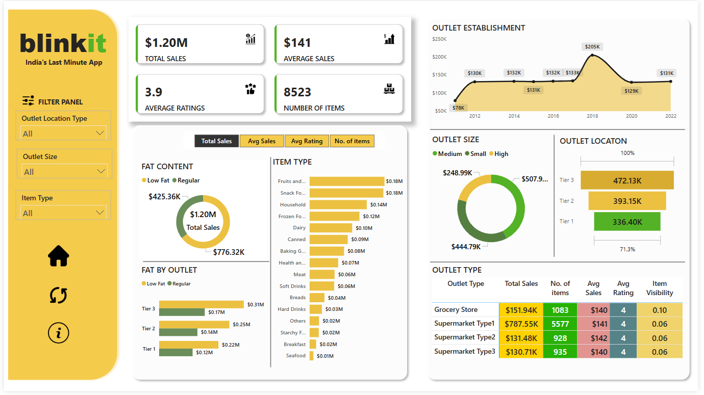

# BlinkitPulse: Consumer & Outlet Analysis

## Project Overview

- This Power BI project delivers a detailed dashboard designed to evaluate Blinkit's sales trends, customer feedback, and inventory management. It leverages KPIs and data visualizations to highlight critical insights and identify opportunities for performance enhancement.

---

## Key Performance Indicators (KPIs)

  - **The dashboard highlights major performance metrics, including**:

    1. **Total Sales**: $1.20M in revenue from all items
    2. **Average Sales**: Average revenue per sale ($141)
    3. **Number of Items**: 8,523 unique product units
    4. **Average Rating**: 3.9 out of 5

  ---

## Features

  - **Filter Panel**: Enables filtering by outlet location, size, and product type
  - **Outlet Establishment Trend**: Tracks outlet growth from 2012–2022
  - **Fat Content Analysis**: Analyzes sales across low-fat and regular-fat items
  - **Item Type Distribution**: Displays sales across different product categories
  - **Outlet Size and Location Analysis**: Compares sales by outlet size and location tier
  - **Outlet Type Comparison**: Evaluates outlet types based on sales, ratings, inventory, and visibility

---

## Dashboard Visual

---

## Insights and Conclusions
  - Blinkit shows strong sales, crossing the $1M mark.
  - Low-fat items are preferred, suggesting a health-conscious customer base.
  - Fruits, vegetables, and snacks are the highest-selling categories.
  - Medium-sized outlets in Tier 3 areas yield the highest profitability.
  - Supermarkets lead in sales, while grocery stores rank high in product visibility.

